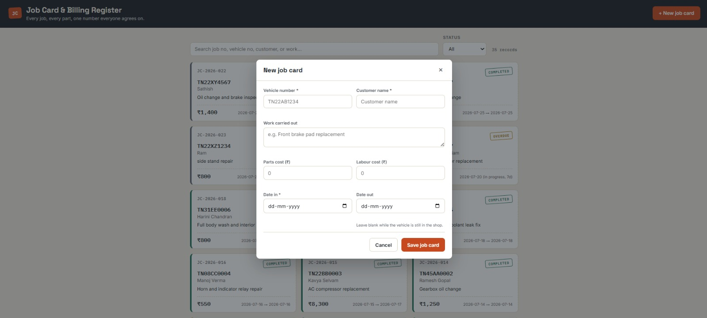
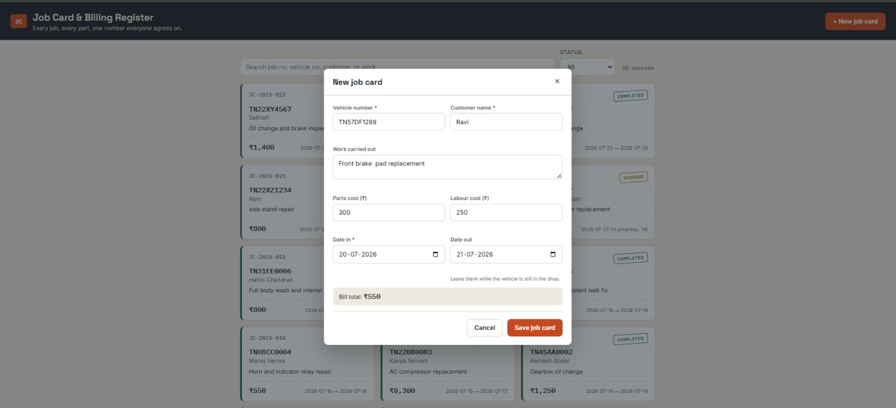
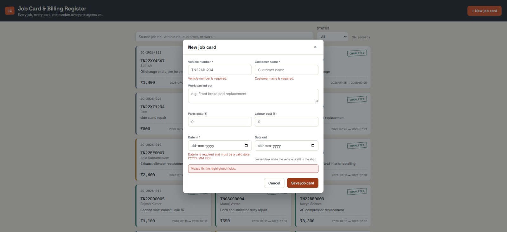
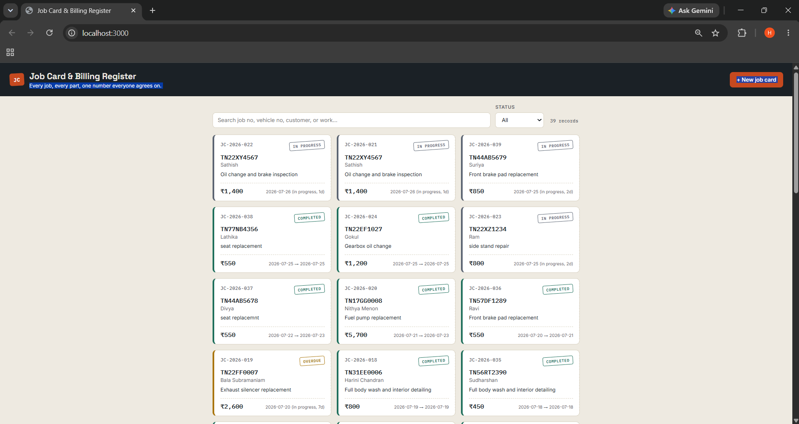

# Vehicle Service Centre — Job Card & Billing Register

**Problem, in two lines:** A small service centre's paper job cards get lost or amended mid-job, so the bill customers finally see rarely matches what they were quoted, and nobody can reconstruct what work was actually done. This app records every job, its parts and labour as they're added, and calculates one bill total that the shop and the customer both see and agree on.

Built for SIH 2026 Internal Practical Assessment — PDKVCET, Cyber, Year II.

---

## Tech stack

- **Backend:** Node.js + Express, REST API
- **Database:** SQLite, via Node's built-in `node:sqlite` module (Node ≥ 22.5 — no external database driver to install, no native compilation)
- **Frontend:** Plain HTML/CSS/JavaScript (no build step, no framework) — a single page that talks to the API with `fetch`

## How to run it

```bash
# 1. Install dependencies (just Express)
npm install

# 2. Load the sample dataset (20 job card records) into a fresh SQLite database
npm run seed

# 3. Start the server
npm start

# 4. Open the app
#    http://localhost:3000
```

Requires **Node.js 22.5 or later** (for the built-in SQLite support). Check your version with `node -v`.

Re-running `npm run seed` at any point wipes the database back to the original 20 sample records — useful if you want to reset after testing.

---

## Task 1 — The dataset

20 job card records live in `server/seed.js` and load into a `job_cards` table (see `server/db.js` for the schema). Fields:

| Field | Meaning | Values |
|---|---|---|
| `job_id` | Unique job card number, assigned automatically | e.g. `JC-2026-001` |
| `vehicle_no` | Vehicle registration number | free text, required |
| `customer` | Customer's name | free text, required |
| `work_description` | What work was carried out | free text, can be left blank while work is still being decided |
| `parts_cost` | Cost of parts used, in ₹ | number ≥ 0, or blank if not yet billed |
| `labour_cost` | Cost of labour, in ₹ | number ≥ 0, or blank if not yet billed |
| `date_in` | Date the vehicle arrived | `YYYY-MM-DD`, required |
| `date_out` | Date the vehicle was returned to the customer | `YYYY-MM-DD`, blank while the job is still in progress |
| `total` | **Derived** — see below, never stored or entered directly | calculated |
| `status` | **Derived** — see below, never stored or entered directly | `In Progress`, `Overdue`, `Completed` |

**Awkward cases included on purpose (used again in Task 4 testing):**
- `JC-2026-009` — missing `parts_cost` (billing isn't finished yet)
- `JC-2026-013` — missing `work_description`
- `JC-2026-004` — a job from 2019 (an unusually old date, to check the app doesn't choke on old records)
- "Rajesh Kumar" appears twice (`JC-2026-002` and `JC-2026-017`) — a duplicate customer name, to check the register tells jobs apart by `job_id`, not by customer name

## Task 2 — The main view

The homepage lists every job card as a ticket-style card showing vehicle number, customer, work, total, and status at a glance — no scrolling needed to see what matters. The search box filters live across job number, vehicle number, customer name, and work description. The status dropdown filters by `In Progress` / `Overdue` / `Completed` / `All`. Below 640px width the grid collapses to a single column and buttons/forms stack, so it's usable on a phone.

### Screenshots

| Main view | Job card form | Filtered / mobile view | Home page |
|---|---|---|---|
|  |  |  |  |

### Demo video

A full walkthrough of the app — adding a job card, editing costs, searching, filtering, and reloading to confirm persistence — is in [`video/record 1.mp4`](video/record%201.mp4).

## Task 3 — Records and the rules

- **Add / update:** the "+ New job card" button and clicking any card open the same form.
- **Server-side validation:** every field is checked again on the server (`server/logic.js`), independent of the browser — vehicle number and customer are required, costs must be numbers ≥ 0, `date_in` is required and must be a real date, `date_out` (if given) can't be before `date_in`. Invalid submissions are rejected with a specific message per field, both inline in the form and returned by the API as `400` with a `fieldErrors` object.
- **Derived values, recalculated every time:** `total`, `billing_complete`, `days_in_shop`, and `status` are never stored in the database — they're computed fresh from `parts_cost`, `labour_cost`, `date_in`, and `date_out` on every read (see `withDerivedFields` in `server/logic.js`). This means there's no way for a stale total or status to exist; changing a cost or a date always shows the correct number immediately, and a live total preview also updates as you type in the form.

**How `total` and `status` are calculated:**
```
total  = (parts_cost or 0) + (labour_cost or 0)
status = "Completed"    if date_out is set
       = "Overdue"      if no date_out AND more than 3 days have passed since date_in
       = "In Progress"  otherwise
```

A total is marked with a small `*` in the list if either `parts_cost` or `labour_cost` is still missing, so the shop knows that figure isn't final yet.

## Task 4 — Loading, empty, and error states

The app has one visible state at a time, never a blank screen:
- **Loading:** a spinner while the list is being fetched.
- **Empty:** shown only if the database genuinely has zero job cards, with a button to add the first one.
- **No results:** shown when search/filter matches nothing (different from "empty" — the data exists, the filter just didn't match).
- **Error:** shown if the API call fails (server down, network error), with the actual problem and a "Try again" button.
- **Record not found:** looked up by an id that doesn't exist returns a `404` with a clear message (tested by requesting a made-up job id).
- **Save failures:** if a create/update/delete request fails, the form stays open, nothing is silently lost, and a clear error explains what happened.

Tested directly against the awkward cases from Task 1 — e.g. opening `JC-2026-009` (missing `parts_cost`) shows total calculated from labour only and a `*` flag, rather than crashing or showing "NaN".

## Task 5 — End-to-end test performed

Manually verified this full journey (also see the demo video):
1. Added a new job card via the form → it appeared instantly at the top of the list.
2. Edited it, changing `parts_cost` → the total and the `*` flag updated immediately.
3. Searched by vehicle number and by customer name → correct single result each time.
4. Filtered by status `Overdue` → only jobs with no `date_out` and more than 3 days elapsed appeared.
5. Reloaded the page from scratch → the new record and the edit were still there (confirms it was actually saved to SQLite, not just held in browser memory).
6. **Hand-checked calculation:** `JC-2026-015` has `parts_cost = 6500`, `labour_cost = 1800` → total shown is `₹8,300`, which matches `6500 + 1800` by hand.

## Task 6 — What's not finished

This is an Easy-level, single-user internal tool. Deliberately left out as out of scope for this assessment:
- No login/authentication — anyone with the URL can add or edit records (fine for a single shared shop terminal, not for a public deployment).
- No printable customer-facing invoice/PDF export — the itemised statement is shown on screen only.
- No pagination — fine for tens or low hundreds of job cards, would need it for a much larger register.
- No audit trail of *who* changed a record or *when* (only the final state is kept).

## Project structure
```
vehicle-job-register/
├── package.json
├── README.md
├── screenshot/
│   ├── screenshot1.jpeg   # Main view
│   ├── screenshot2.jpeg   # Job card form
│   ├── screenshot3.jpeg   # Filtered / mobile view
│   └── screenshot4.png  # Home page
├── video/
│   └── record 1.mp4        # Full demo walkthrough
├── server/
│   ├── server.js      # Express app + REST API routes
│   ├── db.js           # SQLite connection + schema
│   ├── logic.js        # Validation rules + derived-value (total/status) calculations
│   ├── seed.js          # Loads the 20 sample job card records
│   └── data/             # jobcards.db lives here (created on first run)
└── public/
    ├── index.html      # Single-page app shell
    ├── styles.css        # All styling
    └── app.js             # Fetches data, renders cards, handles search/filter/forms/states
```

## API reference

| Method | Endpoint | Purpose |
|---|---|---|
| `GET` | `/api/jobcards?search=&status=` | List job cards, optionally filtered |
| `GET` | `/api/jobcards/:id` | Get one job card |
| `POST` | `/api/jobcards` | Create a job card |
| `PUT` | `/api/jobcards/:id` | Update a job card |
| `DELETE` | `/api/jobcards/:id` | Delete a job card |
